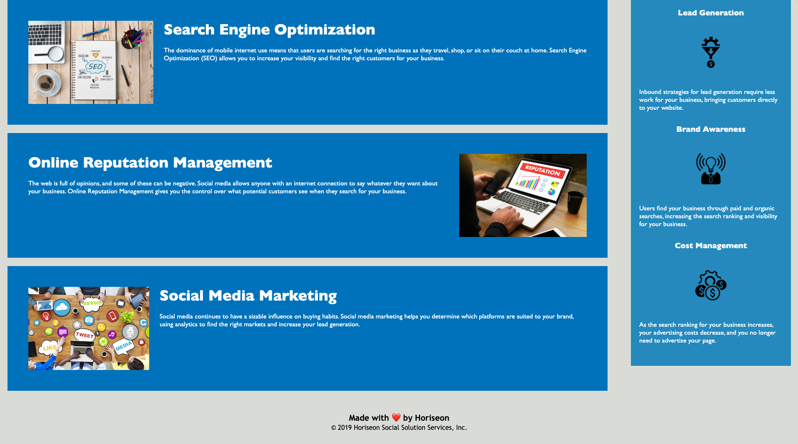

# **Horiseon**

## Table of Contents
1. [Description](#description)  
2. [Links](#links)  
3. [Visuals](#visuals)  
4. [Usage](#usage)  
***

## Description
**Horiseon** is a social solutions service specializing in search engine optimization, online reputation management and social media marketing.
***

## Links
[Link to Horiseon](https://mattholtmoore.github.io/seo-refactor-project/)

[Link to GitHub](https://github.com/mattholtmoore/seo-refactor-project)  
***

## Visuals

## Usage
This website is used for clients who are looking for support in managing and leveraging their online traction and momentum. Here they will become more successful in their online presence. 

